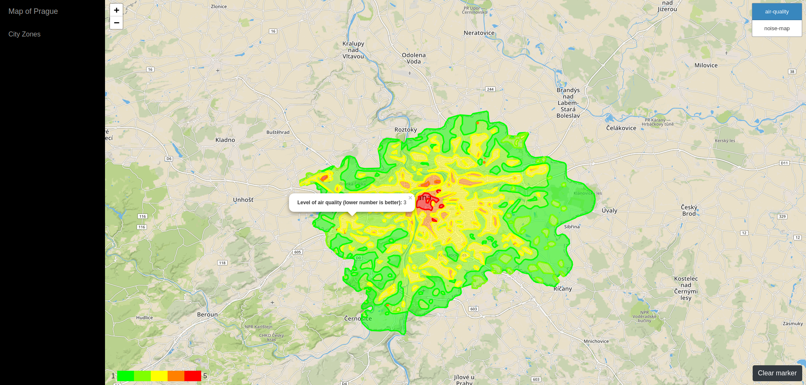
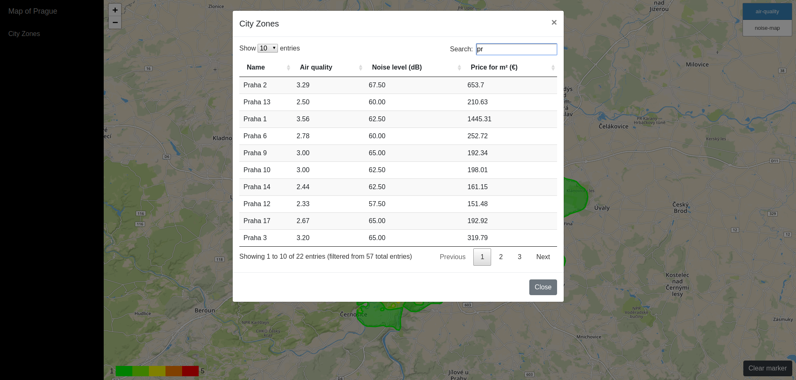
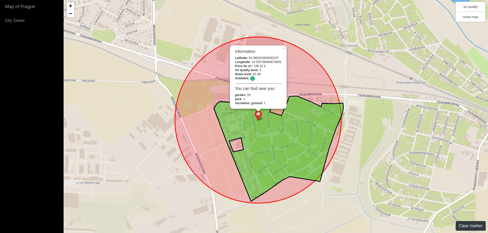

# Overview

This application allows you to find a most appropriate place for living in Prague. The user is able to find out basic information about city zone or selected places such as air quality, noise level or even the price of land. 

There are three possible types of scenarios in this application:
- **color visualization on the map** - the user can choose visualization of the noise level or air quality for Prague
- **search by city zone** -  each zone contains average values of noise level, air quality and price of land
- **specific location** - gives a detail info for selected location on the map, searches for leisure places in a near region and highlight the territorial area depending on availability

#### Screenshots from the application:

1. Color visualization of air quality



2. Overview of city zones searched by name



3. Detail info about selected location on the map



The application has 2 separate parts, the client which is a [frontend web application](#frontend) using mapbox API and leaflet library and the [backend application](#backend) written in [Node.js](https://nodejs.org/en/), backed by PostGIS. The frontend application communicates with backend using a [REST API](#api).

**Technologies used**: [Bootstrap](https://getbootstrap.com/), Javascript, jQuery, [Leaflet](https://leafletjs.com/), [Node.js](https://nodejs.org/en/), [Express](https://expressjs.com/), PostgreSQL, PostGIS

# Frontend
The frontend application is a static HTML page (`index.html`), which shows a map created by Leaflet library and other parts that make possible to user interacts with the map. I used Street map style that fits for searching a place for living.

All relevant frontend code is in `public/js/scripts.js` which is referenced from `index.html`. The frontend code is responsible for:
- displaying the sidebar with  controls for city zones 
  - opening a modal window containing a table of city zones, that allows searching for city zones
- displaying geo features by overlaying the map with a geojson layer, the geojson is provided directly by backend APIs
- creating dynamic geo layers based on their properties (for each geo feature)
- handling clicks on the map and showing the relevant information according to the specific position on the map

# Backend

The backend application is written in `Node.js` using the `Express` framework and is responsible for serving static files to the client, querying geo data from the database and processing some data. Module **db** is used for querying the PostgreSQL database. Queries are stored in queries directory and loaded by using the initQuery function in sql.js. Queries returning geo data are constructed in the way that they directly return 'Feature' GeoJSON format. 'Feature' or 'FeatureCollection' is generated by using standard database functions `ST_AsGeoJSON`, `row_to_json`, `array_agg`, `array_to_json`. Therefore, no further processing is required. 

## Data

Data about Prague lasure places is coming directly from Open Street Maps. I downloaded an extent covering whole Prague (around 1.5GB) and imported it using the `osm2pgsql` tool into the standard OSM schema in WGS 84 with hstore enabled. Data coming from Geoportal Praha was downloaded in `shapefile` format (WGS 84) and imported using `shp2pgsql` tool.

To speedup the queries I created an index on geometry columns `way` or `geom_new`, created from `geom` column by conversion from multi-polygon (2263) to polygon (4326). Created indexes are used to speed up queries which find intersections with polygon or polygon containing specific point on the map.

### Data sources

- [Open Street Maps](https://www.openstreetmap.org/) - for the Prague region
- [Geoportal Praha](http://www.geoportalpraha.cz/cs/opendata#.XARrvHVKg3E) - environment data and territorial data 


Database consists of following tables:
* **bonita_klimatu_mapa** - Comprehensive characterization of air quality, acaccording to all climatological considerations.
* **hlukova_mapa__den** - Noise map of surface transport (day acoustic situation). The original data contained too many polygons, therefore it was simplified by using [mapshaper](https://mapshaper.org/) tool.
* **mestske_casti** - Polygons of 57 city districts in Prague.
* **cenova_mapa** - Price map of building plots in the capital city of Prague.
* **zastavitelne_uzemi** - Definition of land availability (land-use plan) - unstoppable area or available area.
* **planet_osm_polygon** - Contains polygons for the city Prague, part of `Open Street Maps`.


## Api

**Find hotels in proximity to coordinates**

`GET /search?lat=25346&long=46346123`

**Find hotels by name, sorted by proximity and quality**

`GET /search?name=hviezda&lat=25346&long=46346123`

### Response

API calls return json responses with 2 top-level keys, `hotels` and `geojson`. `hotels` contains an array of hotel data for the sidebar, one entry per matched hotel. Hotel attributes are (mostly self-evident):
```
{
  "name": "Modra hviezda",
  "style": "modern", # cuisine style
  "stars": 3,
  "address": "Panska 31"
  "image_url": "/assets/hotels/652.png"
}
```
`geojson` contains a geojson with locations of all matched hotels and style definitions.
